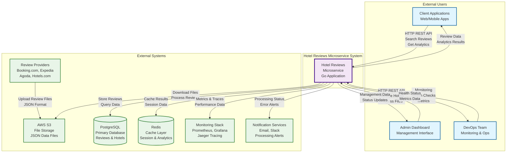
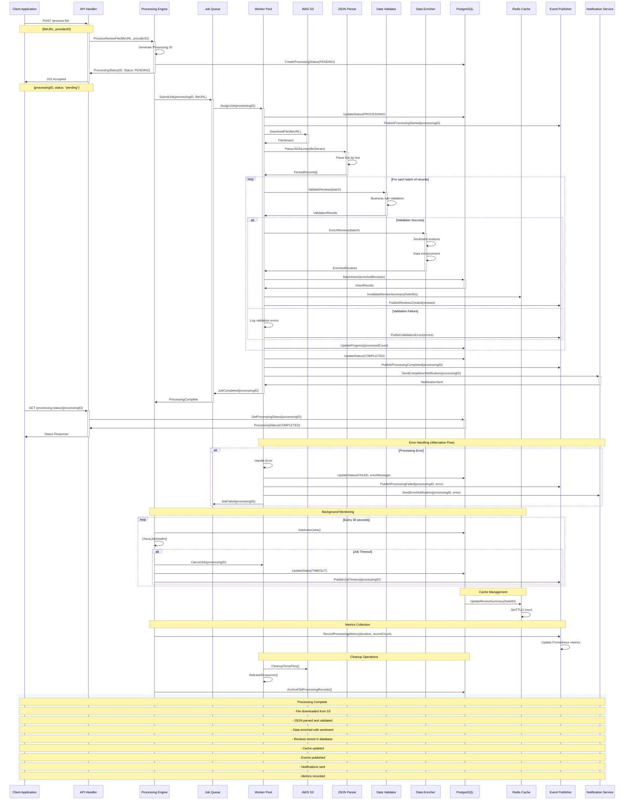
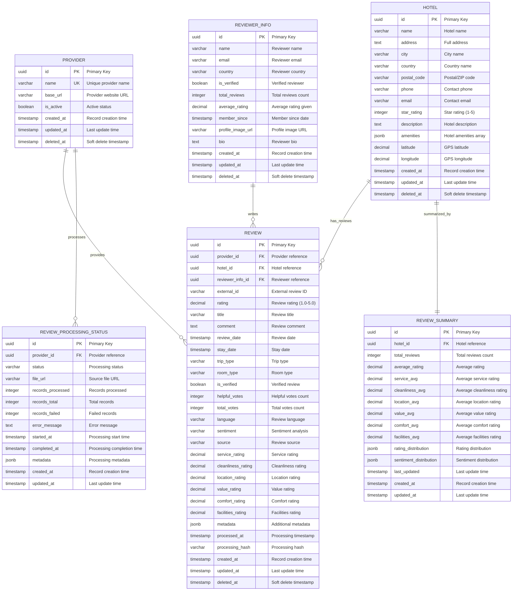

# Hotel Reviews Microservice - Architecture Diagrams

This document contains all architecture diagrams for the Hotel Reviews Microservice, rendered inline for easy viewing.

## 🏗️ 1. System Context Diagram

Shows the hotel reviews microservice and its external dependencies.



## 📦 2. Container Diagram

Shows the internal structure of the hotel reviews microservice.

```mermaid
graph TB
    %% Container Diagram
    %% Shows the internal structure of the hotel reviews microservice
    
    subgraph "Load Balancer"
        LB[Nginx/HAProxy<br/>Load Balancer<br/>SSL Termination]
    end
    
    subgraph "Hotel Reviews Microservice"
        subgraph "API Layer"
            API1[API Instance 1<br/>Port 8080<br/>HTTP Server]
            API2[API Instance 2<br/>Port 8081<br/>HTTP Server]
            API3[API Instance 3<br/>Port 8082<br/>HTTP Server]
        end
        
        subgraph "Processing Layer"
            Worker1[Processing Worker 1<br/>Async File Processing<br/>Goroutine Pool]
            Worker2[Processing Worker 2<br/>Async File Processing<br/>Goroutine Pool]
            Worker3[Processing Worker 3<br/>Async File Processing<br/>Goroutine Pool]
        end
        
        subgraph "Background Services"
            Scheduler[Job Scheduler<br/>Cron Jobs<br/>Maintenance Tasks]
            Monitor[Health Monitor<br/>System Metrics<br/>Alerting]
        end
    end
    
    subgraph "Data Layer"
        subgraph "Primary Storage"
            DB[(PostgreSQL<br/>Primary Database<br/>ACID Transactions)]
            DBReplica[(PostgreSQL<br/>Read Replica<br/>Query Optimization)]
        end
        
        subgraph "Cache Layer"
            Redis[(Redis Cluster<br/>Session Store<br/>Query Cache)]
            RedisReplica[(Redis Replica<br/>Failover<br/>Read Scaling)]
        end
        
        subgraph "File Storage"
            S3[AWS S3<br/>Object Storage<br/>Review Files]
            S3Backup[AWS S3<br/>Backup Bucket<br/>Disaster Recovery]
        end
    end
    
    subgraph "External Services"
        Prometheus[Prometheus<br/>Metrics Collection<br/>Time Series DB]
        Grafana[Grafana<br/>Visualization<br/>Dashboards]
        Jaeger[Jaeger<br/>Distributed Tracing<br/>Performance Monitoring]
        Notifications[Notification Service<br/>Email/Slack<br/>Alert Processing]
    end
    
    %% Load Balancer to API
    LB -->|HTTP/HTTPS<br/>Round Robin| API1
    LB -->|HTTP/HTTPS<br/>Round Robin| API2
    LB -->|HTTP/HTTPS<br/>Round Robin| API3
    
    %% API to Processing
    API1 -.->|Async Jobs<br/>Processing Queue| Worker1
    API2 -.->|Async Jobs<br/>Processing Queue| Worker2
    API3 -.->|Async Jobs<br/>Processing Queue| Worker3
    
    %% API to Data Layer
    API1 -->|SQL Queries<br/>GORM ORM| DB
    API2 -->|SQL Queries<br/>GORM ORM| DB
    API3 -->|SQL Queries<br/>GORM ORM| DB
    
    API1 -->|Cache Operations<br/>Redis Protocol| Redis
    API2 -->|Cache Operations<br/>Redis Protocol| Redis
    API3 -->|Cache Operations<br/>Redis Protocol| Redis
    
    %% Processing to Data Layer
    Worker1 -->|Batch Insert<br/>Review Data| DB
    Worker2 -->|Batch Insert<br/>Review Data| DB
    Worker3 -->|Batch Insert<br/>Review Data| DB
    
    Worker1 -->|Download Files<br/>AWS SDK| S3
    Worker2 -->|Download Files<br/>AWS SDK| S3
    Worker3 -->|Download Files<br/>AWS SDK| S3
    
    %% Background Services
    Scheduler -->|Maintenance<br/>Cleanup Jobs| DB
    Monitor -->|Health Metrics<br/>System Stats| Prometheus
    
    %% Data Replication
    DB -.->|Streaming<br/>Replication| DBReplica
    Redis -.->|Async<br/>Replication| RedisReplica
    S3 -.->|Cross-Region<br/>Replication| S3Backup
    
    %% Monitoring
    API1 -->|Metrics<br/>Traces| Prometheus
    API2 -->|Metrics<br/>Traces| Prometheus
    API3 -->|Metrics<br/>Traces| Prometheus
    
    Worker1 -->|Processing<br/>Metrics| Prometheus
    Worker2 -->|Processing<br/>Metrics| Prometheus
    Worker3 -->|Processing<br/>Metrics| Prometheus
    
    Prometheus -->|Query API<br/>Metrics Data| Grafana
    
    API1 -->|Distributed<br/>Traces| Jaeger
    API2 -->|Distributed<br/>Traces| Jaeger
    API3 -->|Distributed<br/>Traces| Jaeger
    
    Monitor -->|Alert<br/>Notifications| Notifications
    
    %% Styling
    classDef apiClass fill:#e3f2fd,stroke:#1976d2,stroke-width:2px
    classDef processingClass fill:#fff3e0,stroke:#f57c00,stroke-width:2px
    classDef dataClass fill:#e8f5e8,stroke:#388e3c,stroke-width:2px
    classDef monitoringClass fill:#fce4ec,stroke:#c2185b,stroke-width:2px
    classDef lbClass fill:#f3e5f5,stroke:#7b1fa2,stroke-width:2px
    
    class API1,API2,API3 apiClass
    class Worker1,Worker2,Worker3,Scheduler,Monitor processingClass
    class DB,DBReplica,Redis,RedisReplica,S3,S3Backup dataClass
    class Prometheus,Grafana,Jaeger,Notifications monitoringClass
    class LB lbClass
```



## 🔧 3. Component Diagram

Shows the internal components and their relationships.

```mermaid
graph TB
    %% Component Diagram
    %% Shows the internal components and their relationships
    
    subgraph "HTTP Layer"
        Router[Gin Router<br/>HTTP Routing<br/>Middleware Chain]
        
        subgraph "Middleware"
            CORS[CORS Middleware<br/>Cross-Origin<br/>Request Handling]
            Auth[Auth Middleware<br/>JWT Validation<br/>API Key Check]
            RateLimit[Rate Limiter<br/>Request Throttling<br/>DDoS Protection]
            Logging[Request Logger<br/>Access Logs<br/>Request Tracing]
            Recovery[Recovery Middleware<br/>Panic Recovery<br/>Error Handling]
        end
        
        subgraph "HTTP Handlers"
            ReviewHandler[Review Handler<br/>CRUD Operations<br/>Search & Filter]
            HotelHandler[Hotel Handler<br/>Hotel Management<br/>Analytics]
            ProviderHandler[Provider Handler<br/>Provider CRUD<br/>Configuration]
            ProcessingHandler[Processing Handler<br/>File Upload<br/>Status Tracking]
            HealthHandler[Health Handler<br/>System Status<br/>Readiness Check]
        end
    end
    
    subgraph "Application Layer"
        subgraph "Business Services"
            ReviewService[Review Service<br/>Business Logic<br/>Validation Rules]
            ProcessingEngine[Processing Engine<br/>Async Processing<br/>Job Management]
            ValidationService[Validation Service<br/>Data Validation<br/>Business Rules]
            AnalyticsService[Analytics Service<br/>Data Aggregation<br/>Reporting]
        end
        
        subgraph "Processing Components"
            JobQueue[Job Queue<br/>Async Task Queue<br/>Priority Handling]
            WorkerPool[Worker Pool<br/>Goroutine Pool<br/>Concurrent Processing]
            StatusTracker[Status Tracker<br/>Job Progress<br/>State Management]
            BackpressureController[Backpressure Controller<br/>Load Management<br/>Resource Control]
        end
    end
    
    subgraph "Domain Layer"
        subgraph "Domain Services"
            ReviewDomain[Review Domain<br/>Core Business Logic<br/>Entity Operations]
            HotelDomain[Hotel Domain<br/>Hotel Business Rules<br/>Validation]
            ProviderDomain[Provider Domain<br/>Provider Logic<br/>Configuration]
        end
        
        subgraph "Domain Entities"
            Review[Review Entity<br/>Review Data Model<br/>Business Rules]
            Hotel[Hotel Entity<br/>Hotel Data Model<br/>Validation]
            Provider[Provider Entity<br/>Provider Model<br/>Configuration]
            ProcessingStatus[Processing Status<br/>Job State Model<br/>Tracking]
        end
    end
    
    subgraph "Infrastructure Layer"
        subgraph "Data Access"
            ReviewRepo[Review Repository<br/>Database Operations<br/>Query Optimization]
            HotelRepo[Hotel Repository<br/>Hotel Data Access<br/>Caching]
            ProviderRepo[Provider Repository<br/>Provider Data<br/>Configuration]
            ProcessingRepo[Processing Repository<br/>Job Status<br/>History]
        end
        
        subgraph "External Clients"
            S3Client[S3 Client<br/>File Operations<br/>AWS SDK]
            CacheClient[Cache Client<br/>Redis Operations<br/>Session Management]
            MetricsClient[Metrics Client<br/>Prometheus<br/>Performance Tracking]
            NotificationClient[Notification Client<br/>Email/Slack<br/>Alert System]
        end
        
        subgraph "File Processing"
            JSONProcessor[JSON Processor<br/>File Parsing<br/>Data Extraction]
            FileValidator[File Validator<br/>Schema Validation<br/>Data Quality]
            DataEnricher[Data Enricher<br/>Sentiment Analysis<br/>Data Enhancement]
        end
    end
    
    subgraph "Configuration & Utils"
        ConfigManager[Config Manager<br/>Environment Config<br/>Settings Management]
        Logger[Logger<br/>Structured Logging<br/>Context Logging]
        ErrorHandler[Error Handler<br/>Error Processing<br/>Recovery Logic]
    end
    
    %% HTTP Layer Connections
    Router --> CORS
    Router --> Auth
    Router --> RateLimit
    Router --> Logging
    Router --> Recovery
    
    Router --> ReviewHandler
    Router --> HotelHandler
    Router --> ProviderHandler
    Router --> ProcessingHandler
    Router --> HealthHandler
    
    %% Handler to Service Connections
    ReviewHandler --> ReviewService
    HotelHandler --> ReviewService
    ProviderHandler --> ReviewService
    ProcessingHandler --> ProcessingEngine
    HealthHandler --> ReviewService
    
    %% Service to Domain Connections
    ReviewService --> ReviewDomain
    ReviewService --> HotelDomain
    ReviewService --> ProviderDomain
    
    ProcessingEngine --> ReviewDomain
    ProcessingEngine --> JobQueue
    ProcessingEngine --> WorkerPool
    ProcessingEngine --> StatusTracker
    ProcessingEngine --> BackpressureController
    
    ValidationService --> ReviewDomain
    ValidationService --> HotelDomain
    ValidationService --> ProviderDomain
    
    AnalyticsService --> ReviewDomain
    AnalyticsService --> HotelDomain
    
    %% Domain to Entity Connections
    ReviewDomain --> Review
    HotelDomain --> Hotel
    ProviderDomain --> Provider
    ReviewDomain --> ProcessingStatus
    
    %% Domain to Repository Connections
    ReviewDomain --> ReviewRepo
    HotelDomain --> HotelRepo
    ProviderDomain --> ProviderRepo
    ReviewDomain --> ProcessingRepo
    
    %% Repository to External Connections
    ReviewRepo --> CacheClient
    HotelRepo --> CacheClient
    
    %% Processing to External Connections
    ProcessingEngine --> S3Client
    ProcessingEngine --> JSONProcessor
    ProcessingEngine --> FileValidator
    ProcessingEngine --> DataEnricher
    ProcessingEngine --> NotificationClient
    
    %% Cross-cutting Concerns
    ReviewService --> MetricsClient
    ProcessingEngine --> MetricsClient
    ReviewService --> Logger
    ProcessingEngine --> Logger
    
    ReviewService --> ErrorHandler
    ProcessingEngine --> ErrorHandler
    
    ReviewService --> ConfigManager
    ProcessingEngine --> ConfigManager
    
    %% Styling
    classDef httpClass fill:#e3f2fd,stroke:#1976d2,stroke-width:2px
    classDef appClass fill:#fff3e0,stroke:#f57c00,stroke-width:2px
    classDef domainClass fill:#e8f5e8,stroke:#388e3c,stroke-width:2px
    classDef infraClass fill:#fce4ec,stroke:#c2185b,stroke-width:2px
    classDef configClass fill:#f3e5f5,stroke:#7b1fa2,stroke-width:2px
    
    class Router,CORS,Auth,RateLimit,Logging,Recovery,ReviewHandler,HotelHandler,ProviderHandler,ProcessingHandler,HealthHandler httpClass
    class ReviewService,ProcessingEngine,ValidationService,AnalyticsService,JobQueue,WorkerPool,StatusTracker,BackpressureController appClass
    class ReviewDomain,HotelDomain,ProviderDomain,Review,Hotel,Provider,ProcessingStatus domainClass
    class ReviewRepo,HotelRepo,ProviderRepo,ProcessingRepo,S3Client,CacheClient,MetricsClient,NotificationClient,JSONProcessor,FileValidator,DataEnricher infraClass
    class ConfigManager,Logger,ErrorHandler configClass
```



## 🔄 4. File Processing Sequence

Shows the complete flow of file processing from upload to completion.



## 🌐 5. API Request Sequence

Shows the flow of a typical API request through the system.

```mermaid
sequenceDiagram
    %% API Request Sequence Diagram
    %% Shows the flow of a typical API request through the system
    
    participant Client as Client App
    participant LB as Load Balancer
    participant API as API Handler
    participant Auth as Auth Middleware
    participant RateLimit as Rate Limiter
    participant Service as Review Service
    participant Cache as Redis Cache
    participant DB as PostgreSQL
    participant Events as Event Publisher
    participant Metrics as Metrics Collector
    
    %% Request Flow
    Client->>+LB: GET /api/v1/reviews?hotel_id=123
    Note over Client,LB: HTTP Request with JWT token
    
    LB->>+API: Route to available instance
    
    %% Middleware Chain
    API->>+Auth: ValidateToken(jwt)
    Auth->>Auth: Verify JWT signature
    Auth->>Auth: Check token expiration
    Auth->>-API: User context
    
    API->>+RateLimit: CheckRateLimit(userID)
    RateLimit->>RateLimit: Check request count
    RateLimit->>-API: Rate limit OK
    
    API->>API: Parse query parameters
    API->>API: Validate input data
    
    %% Service Layer
    API->>+Service: GetReviewsByHotel(hotelID, limit, offset)
    
    %% Cache Check
    Service->>+Cache: Get("reviews:hotel:123:page:1")
    Cache->>-Service: Cache miss
    
    %% Database Query
    Service->>+DB: SELECT * FROM reviews WHERE hotel_id = $1
    DB->>DB: Execute query with index
    DB->>-Service: Review records
    
    %% Data Processing
    Service->>Service: Apply business rules
    Service->>Service: Format response data
    
    %% Cache Update
    Service->>Cache: Set("reviews:hotel:123:page:1", data, TTL=1h)
    
    %% Event Publishing
    Service->>Events: PublishReviewsQueried(hotelID, count)
    
    %% Metrics Collection
    Service->>Metrics: RecordAPICall(endpoint, duration, status)
    
    Service->>-API: ReviewsResponse
    
    %% Response Flow
    API->>API: Set response headers
    API->>API: Format JSON response
    API->>-LB: 200 OK with review data
    
    LB->>-Client: HTTP Response
    
    %% Error Handling Flow
    Note over Client,Metrics: Error Handling (Alternative Flow)
    
    alt Authentication Error
        Auth->>API: Unauthorized error
        API->>Metrics: RecordError(401, "auth_failed")
        API->>Client: 401 Unauthorized
    else Rate Limit Exceeded
        RateLimit->>API: Rate limit exceeded
        API->>Metrics: RecordError(429, "rate_limit")
        API->>Client: 429 Too Many Requests
    else Database Error
        DB->>Service: Database connection error
        Service->>Metrics: RecordError(500, "db_error")
        Service->>API: Internal server error
        API->>Client: 500 Internal Server Error
    end
    
    %% Caching Flow (Alternative)
    Note over Service,Cache: Cache Hit (Alternative Flow)
    
    alt Cache Hit
        Service->>Cache: Get("reviews:hotel:123:page:1")
        Cache->>Service: Cached data
        Service->>API: ReviewsResponse (from cache)
        Note over Service,Cache: Database query skipped
    end
    
    %% Monitoring and Logging
    Note over API,Metrics: Cross-cutting Concerns
    
    API->>Metrics: LogRequest(method, path, userID, duration)
    API->>Metrics: RecordLatency(endpoint, responseTime)
    Service->>Metrics: RecordCacheHitRate(endpoint, hitRate)
    
    %% Background Operations
    Note over Cache,Events: Background Processing
    
    loop Every 5 minutes
        Cache->>Cache: EvictExpiredKeys()
        Events->>Events: ProcessEventQueue()
        Metrics->>Metrics: AggregateMetrics()
    end
    
    %% Health Check Flow
    rect rgb(245, 255, 245)
        Note over Client,Metrics: Health Check Flow
        Client->>API: GET /health
        API->>DB: SELECT 1
        API->>Cache: PING
        API->>Client: 200 OK {"status": "healthy"}
    end
    
    %% Complex Query Flow
    rect rgb(255, 245, 245)
        Note over Client,Metrics: Complex Search Query
        Client->>API: POST /api/v1/reviews/search
        Note over Client,API: {query, filters, pagination}
        
        API->>Service: SearchReviews(query, filters)
        Service->>DB: Full-text search with filters
        Service->>Service: Apply ranking algorithm
        Service->>Service: Aggregate results
        Service->>API: SearchResults
        API->>Client: Paginated search results
    end
    
    %% Performance Optimization
    Note over Service,DB: Performance Considerations
    
    Service->>DB: Use connection pooling
    Service->>Cache: Implement cache warming
    Service->>Service: Batch database operations
    Service->>Events: Async event processing
    
    %% Summary
    rect rgb(248, 248, 255)
        Note over Client,Metrics: Request Summary
        Note over Client,Metrics: - Authentication validated
        Note over Client,Metrics: - Rate limiting enforced
        Note over Client,Metrics: - Cache checked (miss/hit)
        Note over Client,Metrics: - Database query executed
        Note over Client,Metrics: - Business logic applied
        Note over Client,Metrics: - Response formatted
        Note over Client,Metrics: - Events published
        Note over Client,Metrics: - Metrics recorded
    end
```



## 🗄️ 6. Database Schema ERD

Shows the complete database schema with relationships.



---

## 🛠️ Usage Instructions

### Viewing Online
These diagrams are automatically rendered on GitHub and other Mermaid-compatible platforms.

### Generating Images
Use the provided script to generate PNG and SVG images:

```bash
./generate-diagrams.sh
```

### Editing Diagrams
1. Edit the `.mmd` files in this directory
2. Use [Mermaid Live Editor](https://mermaid.live/) for real-time preview
3. Regenerate images after changes

### Integration
These diagrams complement the comprehensive architecture documentation in `../architecture.md`.

---

*Generated for Hotel Reviews Microservice Architecture Documentation*